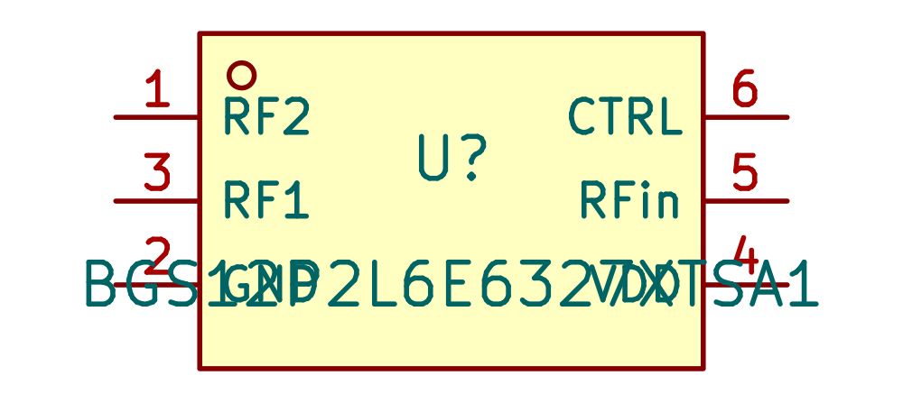
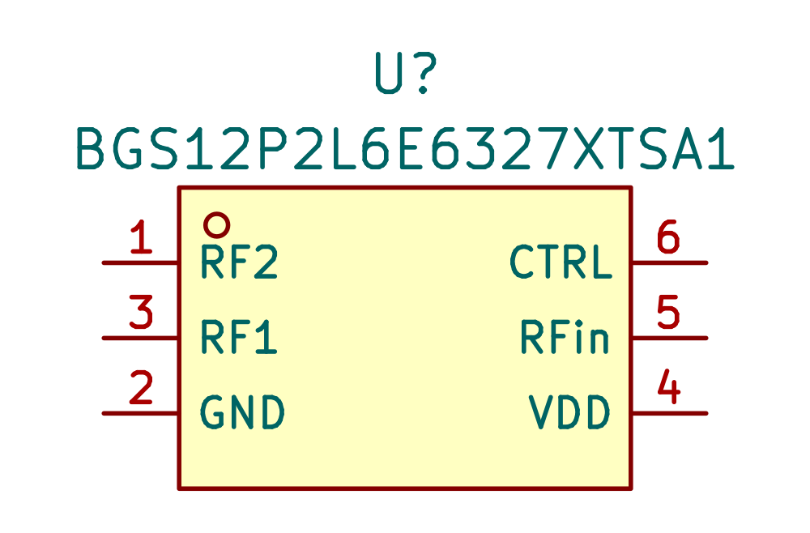
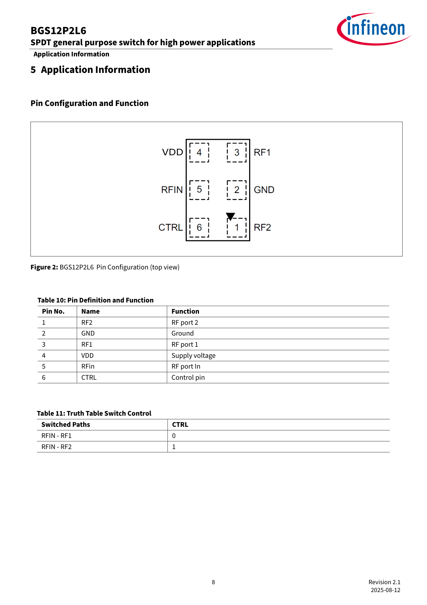
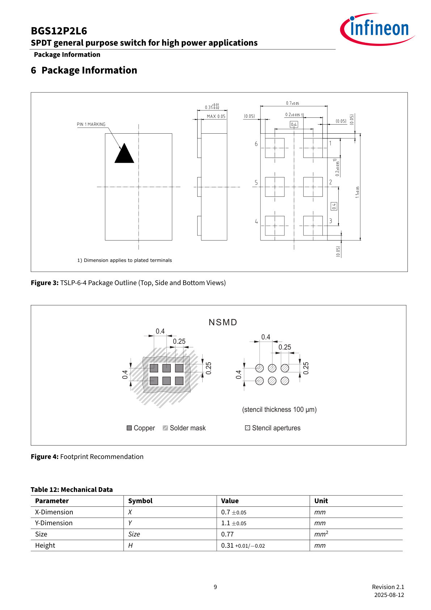
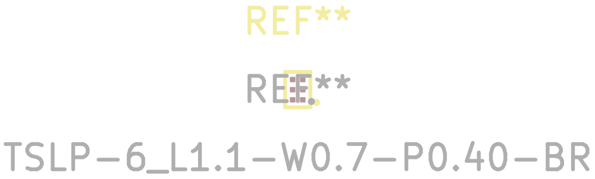
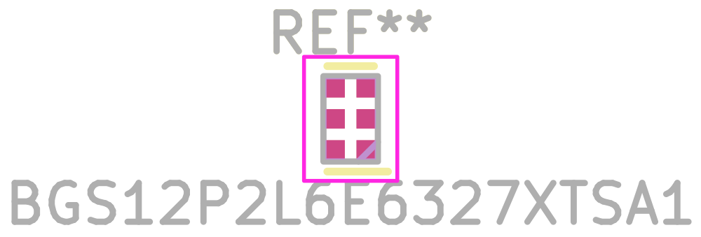
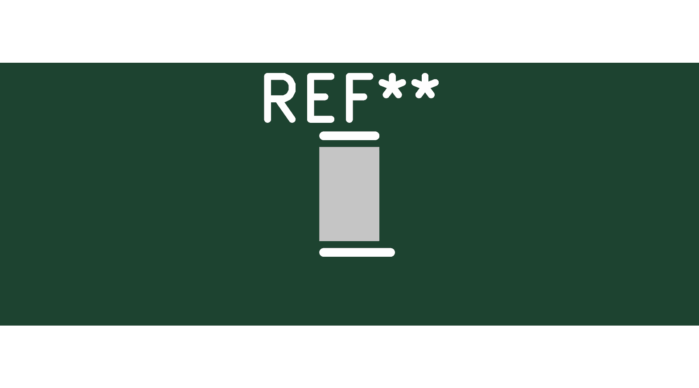
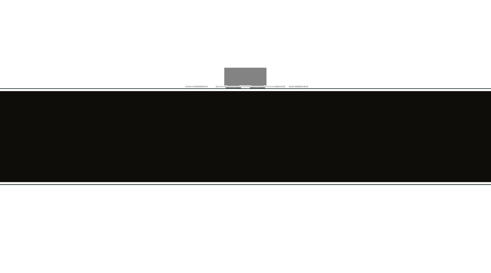
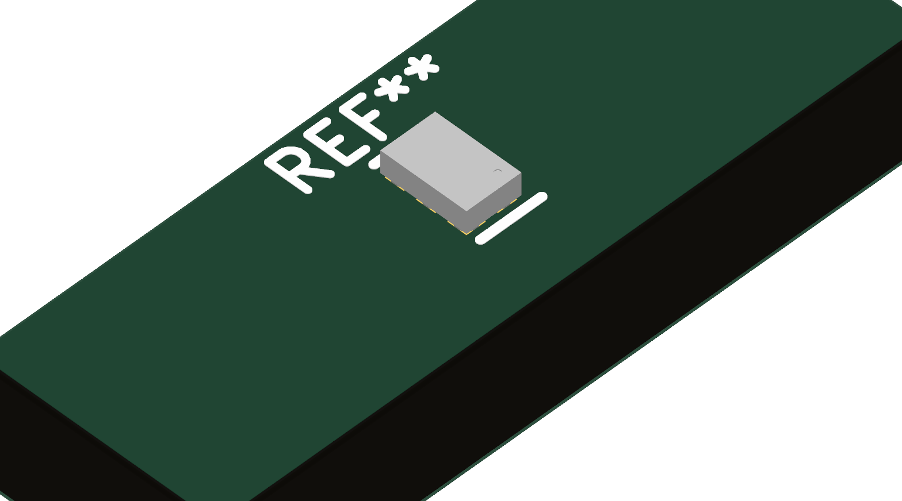

# BGS12P2L6E6327XTSA1 → RF_Wireless_KSL

Created 8 September 2026 for the explicitly approved shared-antenna switch. [BGS12P2L6E6327XTSA1 / C3312945](https://search.raph.io/?q=C3312945).

| Evidence | Verified result and limits |
|---|---|
| Primary source | [Infineon BGS12P2L6 Rev2.1, 12 August 2025](https://www.infineon.com/assets/row/public/documents/24/49/infineon-bgs12p2l6-datasheet-en.pdf), local `${KSL_ROOT}/datasheets/BGS12P2L6E6327XTSA1.pdf`. Public English maker PDF. Its reused internal diagram on printed p7 does not change the document's public publication status; canonical NDA tree gate passes. |
| Exact identity | P2 TSLP-6-4 variant. JLC CAD returned full suffix BGS12P2L6E6327XTSA1 for C3312945, while LCSC shortens the listing name. Verify complete orderable identity on the supplier purchase order; do not substitute BGS12PL6. |
| Pin map | Printed p8 Fig2: 1 RF2, 2 GND, 3 RF1, 4 VDD, 5 RFin, 6 CTRL. Six schematic pins match six numbered copper pads; no exposed pad. CTRL LOW connects common RFin to RF1; HIGH selects RF2. Unselected branch is reflective/shorted internally. |
| Electrical limits | VDD 1.65–3.4 V; CTRL LOW≤0.45 V, HIGH≥1.0 V and≤VDD; CTRL leakage≤10 nA. All RF terminals require zero DC bias. Supply110 µA maximum for LOW or HIGH≥1.35 V,115 µA maximum in the1.0–1.35 V HIGH region. Source does not require supply decoupling. Circuit-level signal margins, RF match, ESD and handover are separate validation obligations. |
| Timing | Table9 switch max2.5 µs and power-up max7.5 µs are at25°C on the application board. They are not full-temperature guaranteed bounds. |
| Mechanical authority | Printed p9 Table12/Fig3: nominal body0.7×1.1 mm with±0.05 mm XY tolerance. Height0.31 +0.01/−0.02 mm gives **0.32 mm maximum**; use this exact tolerance instead of the shortened0.31 mm feature headline. |
| View orientation | Chosen footprint follows application Fig2 **top view**, with pin1 lower-right. Package Fig3 top view is the same orientation rotated180°. Its bottom view must be mirrored before comparison. Pad positions: 1(+0.2,+0.4),2(+0.2,0),3(+0.2,−0.4),4(−0.2,−0.4),5(−0.2,0),6(−0.2,+0.4) mm in KiCad front view. |
| Copper and paste | Fig4 source land example: six0.25×0.25 mm square NSMD copper lands,0.4 mm XY pitch. Separate unnumbered0.25 mm circular F.Paste apertures preserve the source paste geometry; these are not extra electrical pads. Source stencil is100 µm. Package terminal0.20±0.035 mm is a different dimension and was not reused as the land size. Final mask/paste process tolerances remain fabrication inputs. |
| 3D model | Source-backed simplified nominal model,0.7×1.1×0.31 mm overall, terminals seated atZ=0. A pin1 recess is lower-right in KiCad's top view. Scale1, offset0, rotation0. **Not manufacturer CAD**; exact mold, plating and edge detail are omitted. Use0.32 mm maximum and XY tolerances for clearance. |
| Imported defects corrected | Raw JLC symbol linked to the wrong C534199 datasheet and used unspecified pin types. Raw copper was terminal-sized0.20 mm, rather than source0.25 mm land geometry; raw model extended below the board and its pin1 marking did not agree with the selected footprint orientation. Corrected metadata/types, source lands/paste, and generated a consistent nominal model. Fields are above the symbol and fab reference outside the body. |
| Checks | Symbol/footprint parse, six-pin copper parity, explicit source coordinates, paste geometry and top/front/isometric renders inspected. Model gate0 new issues /17 prior baseline issues; NDA tree passes; exact English verdict accepted. Whole-library datasheet gate has only the2 pre-existing missing capacitor links. |
| Availability | [LCSC C3312945](https://www.lcsc.com/product-detail/C3312945.html), observed8 September2026:985 units, applicable500+ tier$0.2154. This is **15 short of the1k batch before spares**; reserve stock or secure lead time. Price/stock is a dated observation, not an assurance of procurement. |

