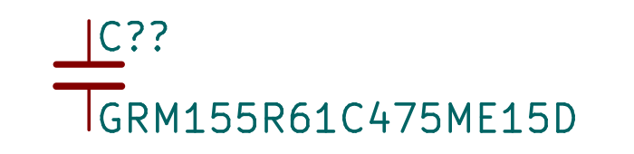
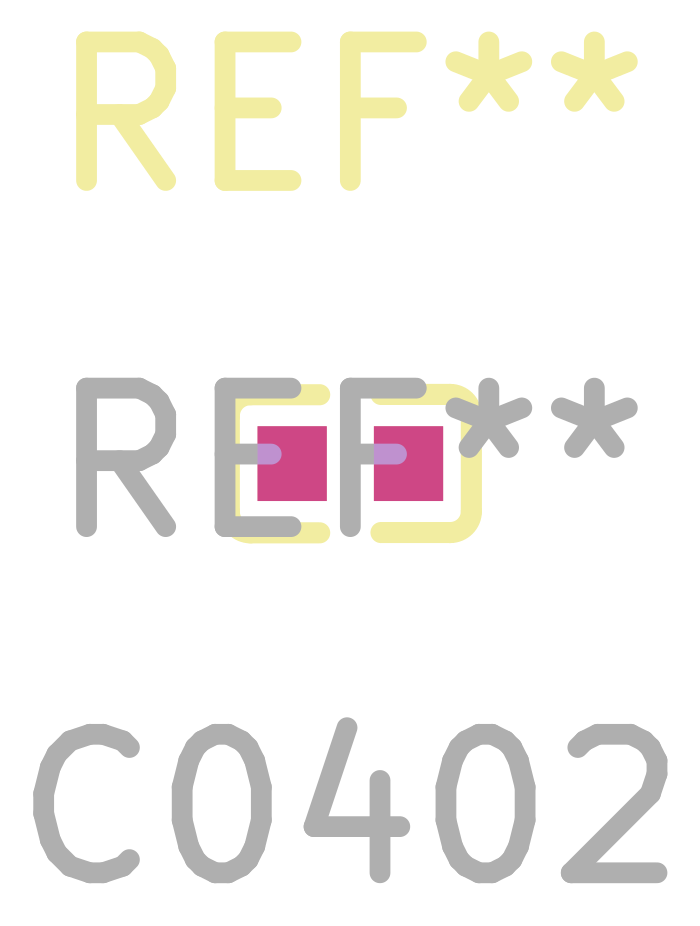
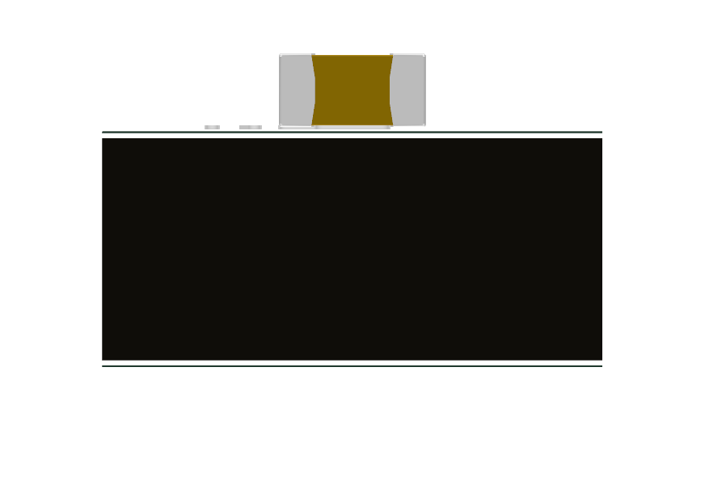
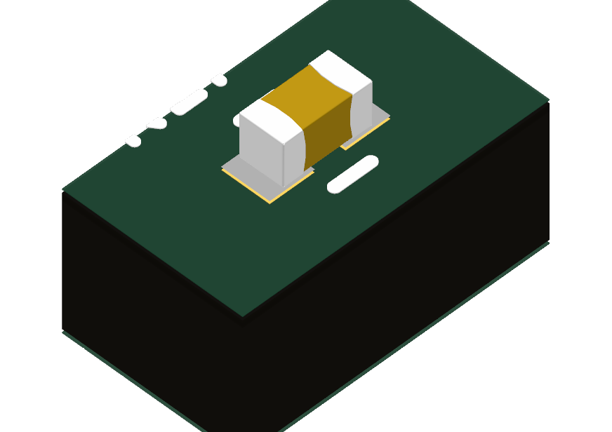

# GRM155R61C475ME15D ([C913526](https://search.raph.io/?q=C913526))

Imported the LCSC CAD, corrected the generic capacitor pin types to passive, and used a compact KiCad capacitor graphic with the same numbered terminals. The part now resolves in Capacitor_KSL.

- Source: LCSC exact C913526 product/CAD retrieved 8 September 2026. Exact datasheet **not found**. LCSC served a general 2018 catalog without the exact MPN; Murata PDF API returned a blank page. These are insufficient, not proof that no source exists. Ratings and package remain provisional distributor data.
- Ratings: 4.7uF 16V +/-20% X5R. Do not release this exact E15 variant until Murata/supplier confirms its dimensional/electrical limits and lifecycle.
- Datasheet: Missing (`~`), deliberately not linked to the wrong catalog.
- Copper: imported two-pad land geometry retained (pad1 left, pad2 right; electrically interchangeable). It is a CAD-provider land pattern, **not** a manufacturer-recommended land pattern. Reflow/solder-mask qualification remains.
- Geometry: 1.0 x0.5 x0.5mm nominal; exact10uF drawing tolerance+/-0.2mm (0.7mm maxheight). 4.7uF nominal body inferred from exact distributor CAD, not sibling drawing verification.
- Model: supplier nominal body, X/Y centered; measured Z range -0.25..+0.25mm translated upward 0.25mm to seat at PCB Z=0. Model is nominal only; final placement must use maximum envelope, not this model as worst-case clearance proof.
- Edits: removed filled comments-layer body graphics and oversized fab text; added clean nominal F.Fab outline and conservative courtyard. Copper retained, nonfunctional graphics corrected. Model coordinate offsets corrected from supplied misplaced/sunken state. Symbols and actual copper both contain terminals1/2.

Renders below use independent zoom, not a dimensional comparison scale.

Validation: KiCad symbol and footprint SVG exports parse; numbered passive pins1/2 match two actual copper pads. Actual before/after2D and top/front/isometric3D renders inspected. Full model gate reports no new violations. Datasheet gate currently has two disclosed missing-local-source findings (4.7uF and22uF); these are not accepted exceptions or fabrication approval.
