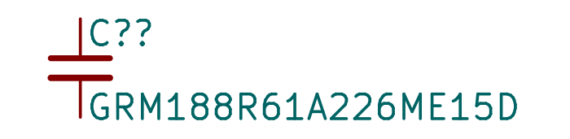
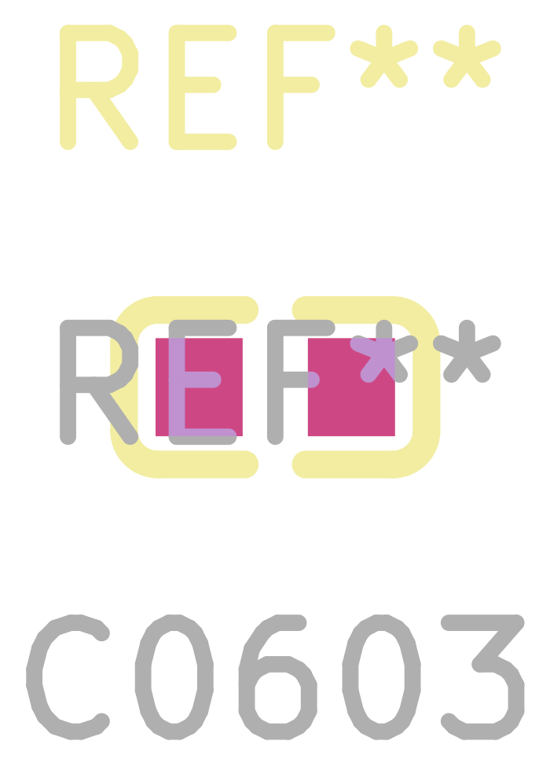
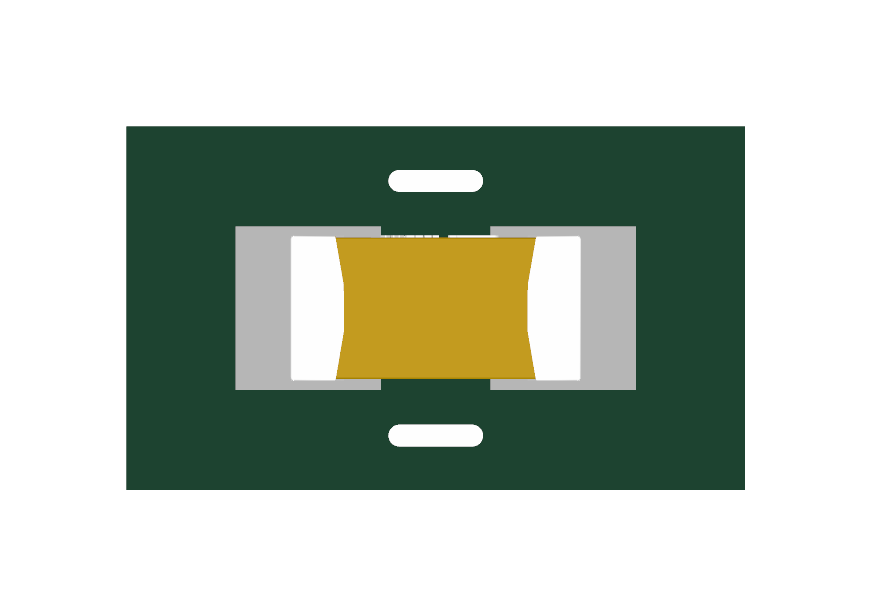
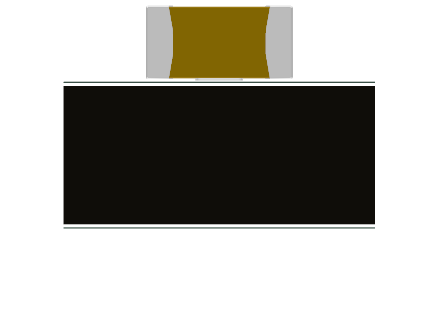
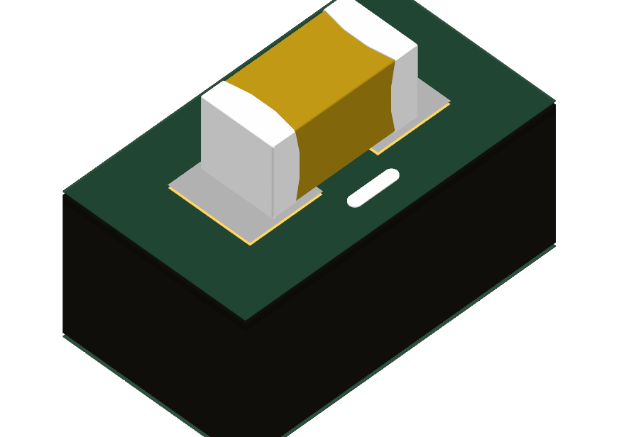

# GRM188R61A226ME15D ([C84419](https://search.raph.io/?q=C84419))

Imported the LCSC CAD, corrected the generic capacitor pin types to passive, and used a compact KiCad capacitor graphic with the same numbered terminals. The part now resolves in Capacitor_KSL.

- Source: LCSC exact C84419 product/CAD retrieved 8 September 2026. Murata-authored exact drawing: https://www.farnell.com/datasheets/2047978.pdf
- Ratings: 22uF 10V +/-20% X5R. Drawing supports dimensions and nominal rating; effective capacitance under DC bias is not qualified.
- Datasheet: **Local PDF unavailable (empty Datasheet field)**. Exact English manufacturer-authored page identified and read through web retrieval, but repeated local download attempts to Farnell timed out and Murata returned a blank PDF. Source dimensions/ratings were readable; local offline datasheet coverage remains open.
- Copper: imported two-pad land geometry retained (pad1 left, pad2 right; electrically interchangeable). It is a CAD-provider land pattern, **not** a manufacturer-recommended land pattern. Reflow/solder-mask qualification remains.
- Geometry: 1.6 x0.8 x0.8mm nominal; drawing tolerance+/-0.2mm (1.0mm maxheight).
- Model: supplier nominal body, X/Y centered; measured Z range -0.4..+0.4mm translated upward 0.4mm to seat at PCB Z=0. Model is nominal only; final placement must use maximum envelope, not this model as worst-case clearance proof.
- Edits: removed filled comments-layer body graphics and oversized fab text; added clean nominal F.Fab outline and conservative courtyard. Copper retained, nonfunctional graphics corrected. Model coordinate offsets corrected from supplied misplaced/sunken state. Symbols and actual copper both contain terminals1/2.

Renders below use independent zoom, not a dimensional comparison scale.

Validation: KiCad symbol and footprint SVG exports parse; numbered passive pins1/2 match two actual copper pads. Actual before/after2D and top/front/isometric3D renders inspected. Full model gate reports no new violations. Datasheet gate currently has two disclosed missing-local-source findings (4.7uF and22uF); these are not accepted exceptions or fabrication approval.

KiCad metadata note: the missing Datasheet is empty, not a tilde sentinel, because KiCad reported a library/cache mismatch for otherwise identical tilde-valued fields. The source gap remains visible in Description and the datasheet audit.
