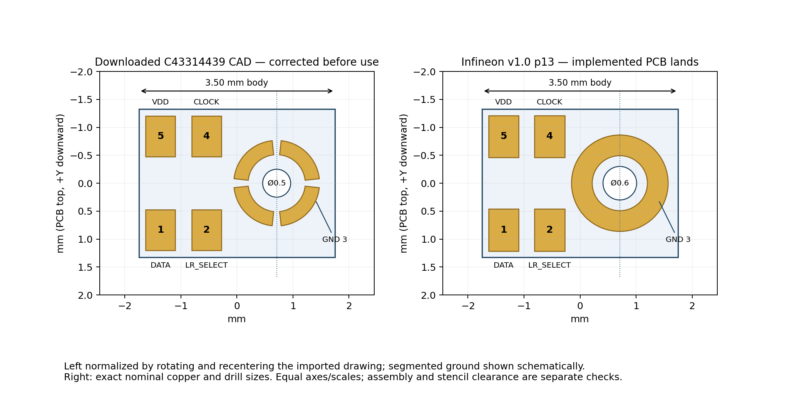
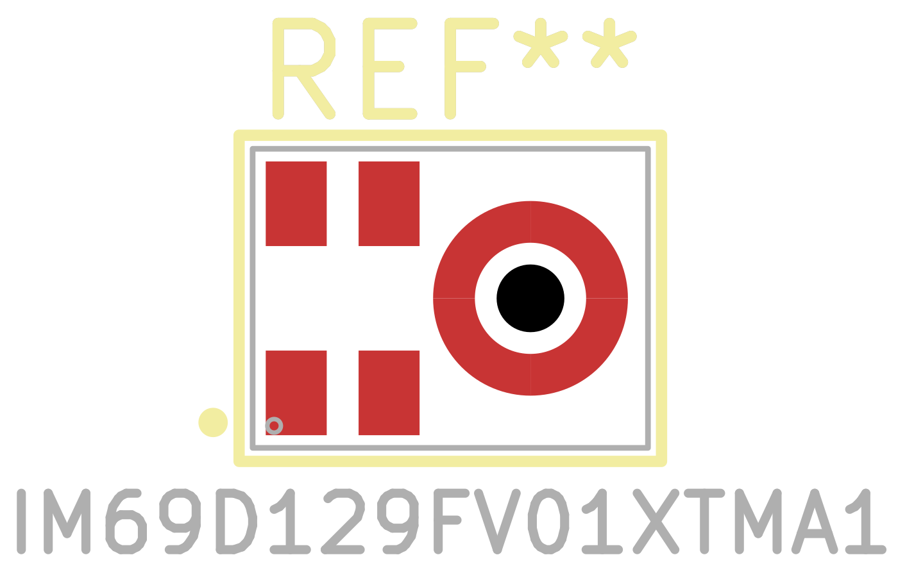
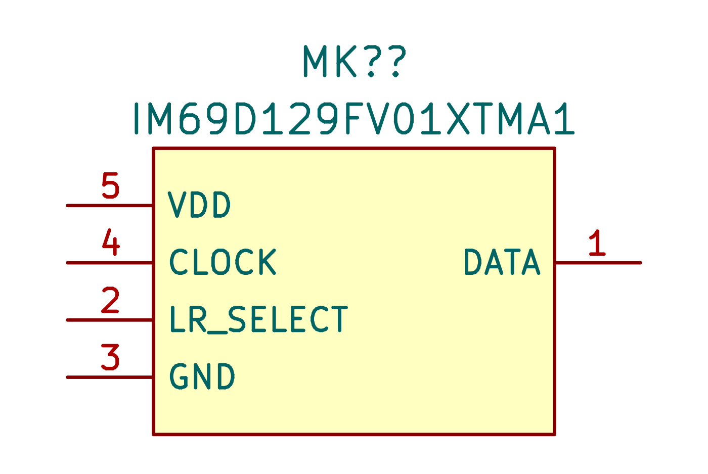
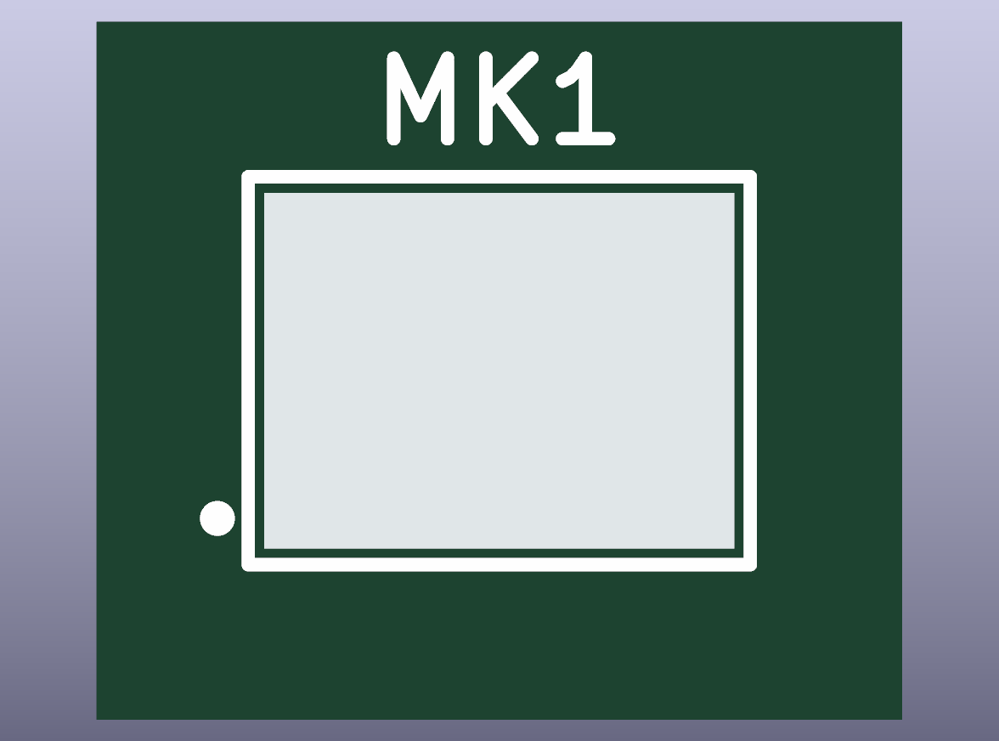
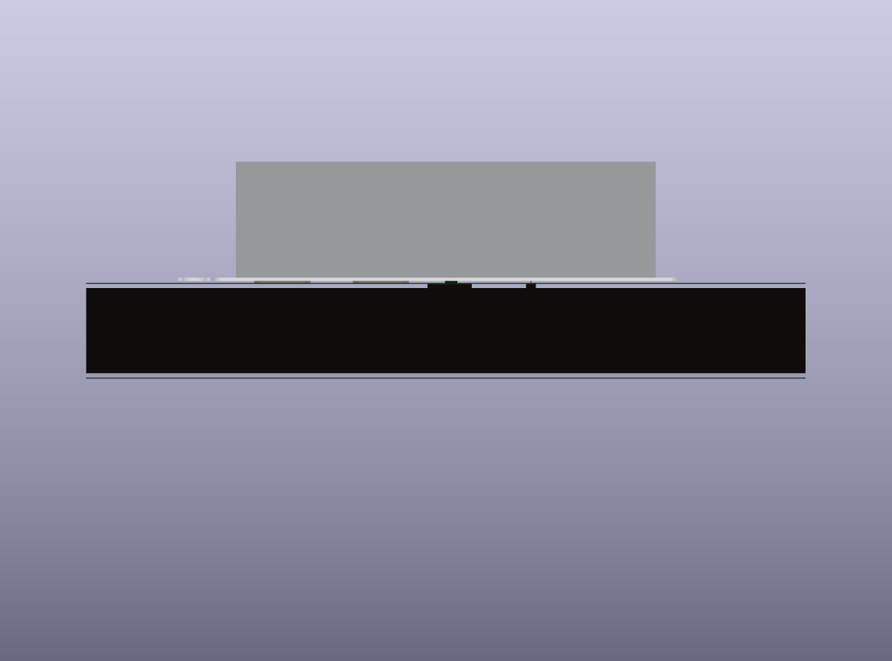
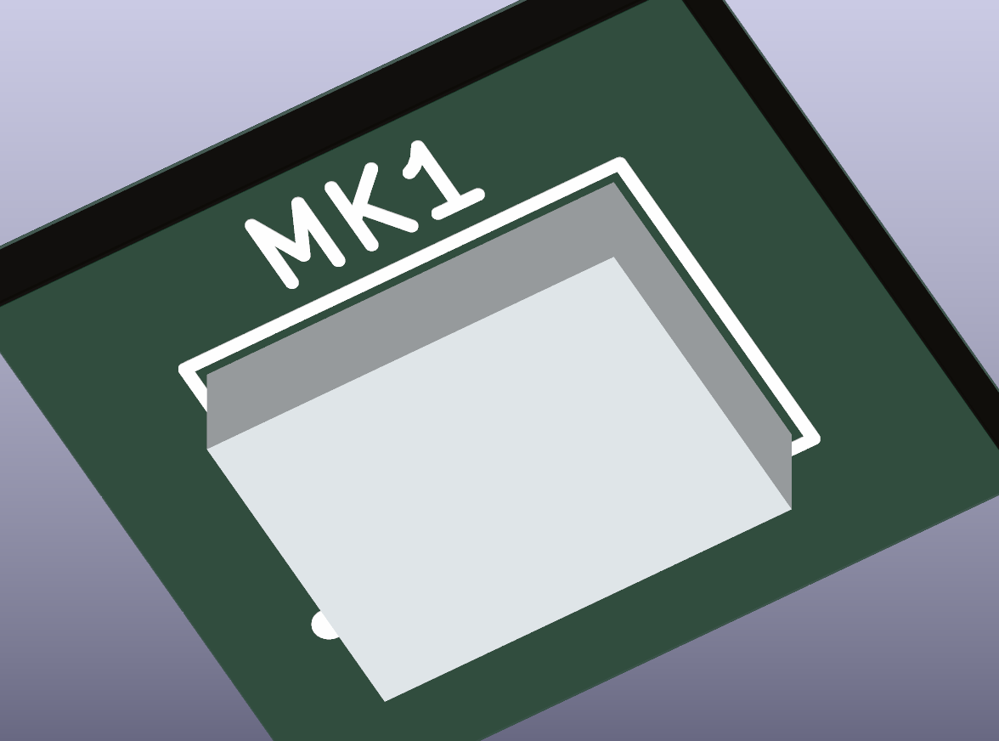

# IM69D129FV01XTMA1 library part

8 September 2026. Added [IM69D129FV01XTMA1 / C43314439](https://search.raph.io/?q=C43314439) to `Microphone_KSL` after confirming it was absent. The remote project explicitly approved this microphone replacement. This is a linked five-pin symbol, corrected PCB footprint, public English datasheet and simplified nominal STEP model.

## Source and import correction

The controlling source is the [Infineon IM69D129FV01 datasheet, v1.0, 21 February 2025](https://www.infineon.com/assets/row/public/documents/24/49/infineon-im69d129f-datasheet-en.pdf), stored at `datasheets/IM69D129FV01XTMA1.pdf`. Pages 8–10 establish the electrical interface, page 12 the package/pins, and page 13 the recommended copper, stencil and acoustic PCB hole. The LCSC page confirms the exact order code, but its rounded package label is not the dimensional authority.

JLC2KiCadLib successfully downloaded C43314439 CAD, but the footprint/model were named for **MP23ABS1TR**. Its pin map was usable; its lands were not Infineon's recommendation. After normalizing the rotated drawing, the imported signal lands were approximately 0.53 × 0.73 mm instead of 0.54 × 0.75 mm; the hole was 0.500025 mm instead of 0.6 mm. Its segmented copper duplicated the stencil, while Infineon specifies a continuous ground annulus. The imported model offset used a legacy inch-valued Y term. These observed differences justify correcting the downloaded CAD instead of importing it unchanged.

## Implemented geometry

All coordinates below are PCB top view, in millimetres, +Y downward. Pin 1 is lower left as explicitly identified in the recommended-land drawing. The signal-pad centres are:

| Pin | Function | X | Y |
|---|---|---:|---:|
| 1 | DATA | −1.364 | +0.838 |
| 2 | LR_SELECT | −0.542 | +0.838 |
| 3 | GND annulus centre | +0.710 | 0 |
| 4 | CLOCK | −0.542 | −0.838 |
| 5 | VDD | −1.364 | −0.838 |

The signal lands are 0.54 × 0.75 mm. Pad 3 is a continuous annulus, outer/inner diameters 1.725/0.985 mm, represented by four touching custom sectors bearing the **same electrical number 3**. The separate 0.6 mm acoustic hole is unplated and unnumbered. The microphone's own port is 0.325 ±0.05 mm; this must not be confused with the recommended larger PCB hole.

Paste is separate from copper: four 0.47 × 0.63 mm apertures with 0.1 mm corner radii, and three rounded annular sectors, radii 0.54/0.83 mm, with 0.12 mm radial gaps. The three gap directions follow the source. Curves are polygon approximations; the generator preserves sub-micrometre radial accuracy. A 0.05 mm mask expansion and a 0.25 mm body-based courtyard allowance are engineering choices, subject to board/assembly-process rules. They are not quoted manufacturer dimensions.

## Model and mechanical limits

The nominal envelope is **3.50 × 2.65 × 0.98 mm**. Use **1.08 mm maximum height** for clearance, plus the actual solder and assembly allowances. The model is centred on the package; terminals sit at Z=0 with zero KiCad offsets, and model Y is the negative of footprint Y. It includes the bottom port and source-based terminal positions. Its metal/base split and colors are illustrative; it is not a manufacturer internal-construction model.

The remote's supplied `MEMS Mic T5837.step` has the same nominal envelope and 0.71 mm port offset magnitude, but models a 0.375 mm microphone opening, equal to the new part’s maximum port diameter. Its local axes differ, and its occurrence is not an assembled placement. Therefore envelope compatibility does **not** establish an aligned PCB hole, acoustic seal, gasket compression or enclosure fit. Those remain layout/mechanical checks using the current STEP folder as authority.

## Verification and source limitations

The symbol's electrical numbers and actual copper IDs both resolve to 1–5. The four ground sectors are intentional duplicate pad 3, not four extra terminals. KiCad loads and exports the footprint and symbol. The linked model is nonempty, nominally 3.50 × 2.65 × 0.98 mm, and its Z minimum is zero within geometry-kernel tolerance. The report visuals were inspected for numbering, text clearance, model presence and seating.

The canonical model gate passes: **zero new placement violations**; 17 earlier unrelated model exceptions remain in the existing baseline. The publication gate passes. Datasheet verification accepts this exact part as English; it still reports two pre-existing capacitor symbols with missing links (`GRM155R61C475ME15D`, `GRM188R61A226ME15D`). Those unrelated symbols were preserved.

Build inputs and scripts are `source-geometry.json` and `Microphone_KSL/scripts/{build,model,render}_im69d129f.py`. The geometry builder needs Shapely; the model builder uses OCP; the coupon builder uses KiCad Python. `footprint-audit.json`, `model-audit.json` and the three gate logs record actual checks. The consuming project separately verifies cached pin identities and electrical net membership.

The source exists and supports package, pins and lands. Remaining limitations are assembly-process tuning, simplified model detail, exact assembled placement and circuit-level qualification; this report does not claim a tested microphone system.
