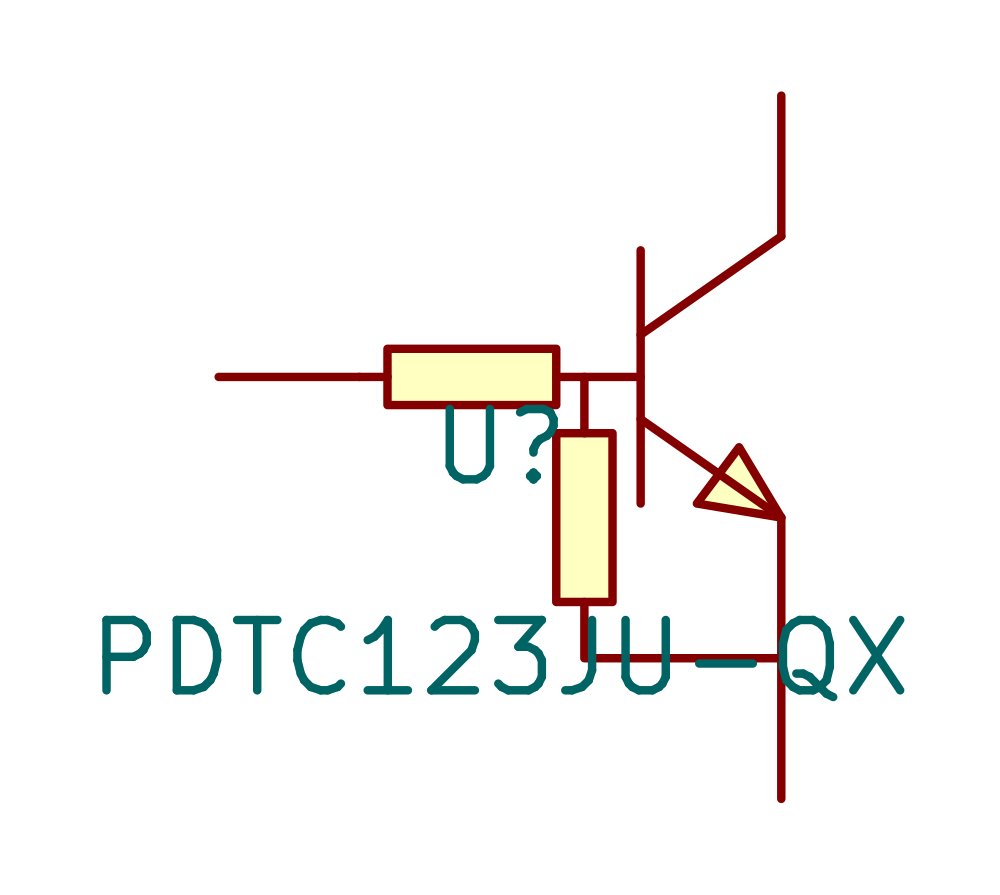
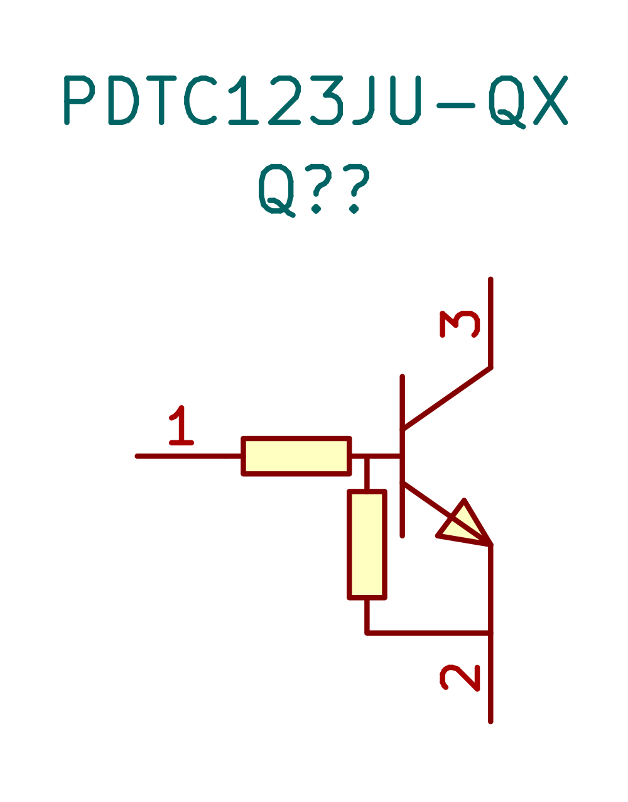
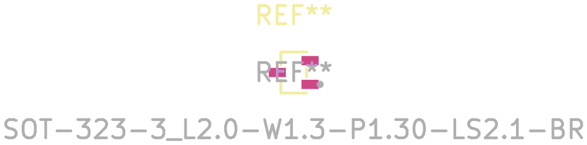
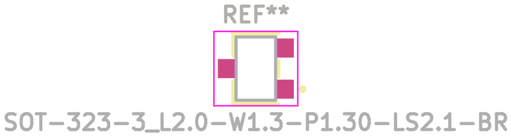
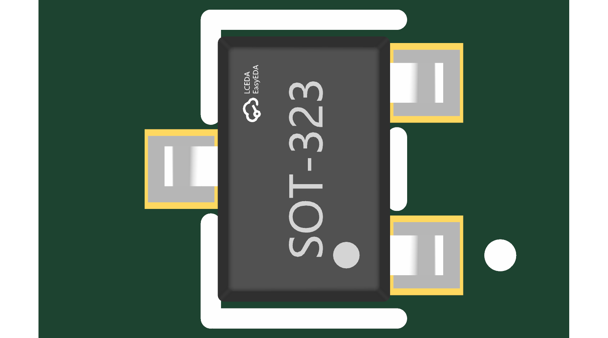
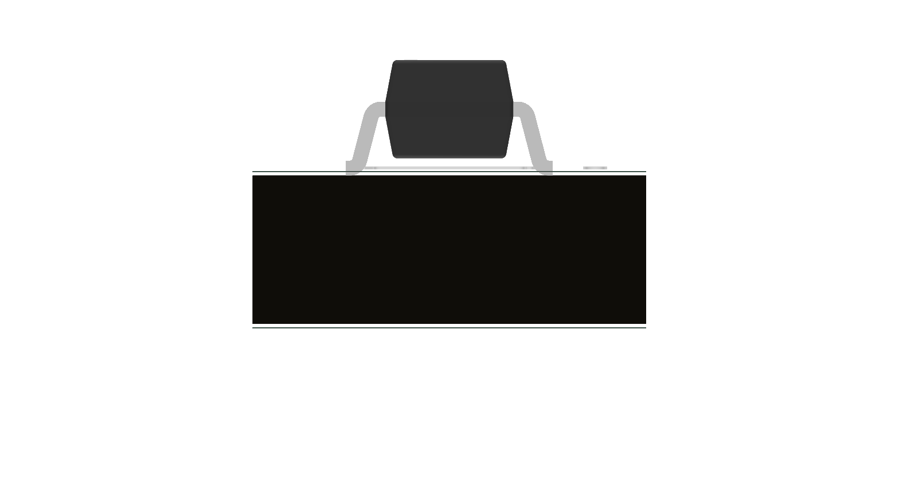
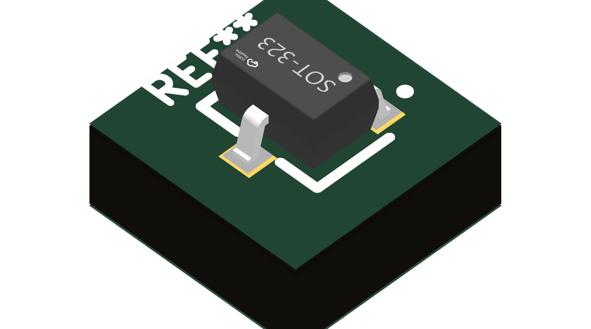

# PDTC123JU-QX — transistor with built-in bias resistors

Imported [PDTC123JU-QX / C7508613](https://search.raph.io/?q=C7508613) into `Transistor_KSL` on 8 September 2026. The library search, attic and history found no existing matching part. JLC2KiCadLib supplied the symbol, footprint and model; the exact manufacturer document was downloaded from LCSC after the manufacturer CDN rejected the direct download. The public [Nexperia source](https://assets.nexperia.com/documents/data-sheet/PDTC123JU-Q.pdf) is dated 7 March 2022. The local English PDF is `${KSL_ROOT}/datasheets/PDTC123JU-QX.pdf`.

The catalog's SOT-23 classification is incorrect: the manufacturer specifies **SOT323 / SC-70**. The manufacturer pin assignments are 1 input, 2 emitter/ground, 3 collector/output; the built-in resistors are 2.2 kΩ and 47 kΩ. All three symbol pin identities match numbered copper pads. Part-level data does not qualify a complete charger or modem application.

| Item | Verified source and correction |
|---|---|
| Symbol | Exact three-pin assignment and NPN resistor topology. Changed reference to Q?, exposed pin numbers, assigned input/passive/open-collector types, moved visible properties clear of the drawing, and linked the local datasheet. |
| Copper lands | Manufacturer p9 Fig11 PCB-top view: pin1 at (+0.925,+0.65), pin2 at (+0.925,-0.65), pin3 at (-0.925,0), mm in KiCad coordinates. Each land is 0.55 × 0.60 mm. Replaced imported 0.936 × 0.50 mm lands at ±0.898 mm. The 1.30 mm contact pitch and 1.85 mm opposing row separation match the source. |
| Paste / outline | Separate 0.50 × 0.50 mm paste apertures follow Fig11. Numberless paste does not count as electrical copper. Body outline uses 2.0 × 1.25 mm nominal; occupied area 2.65 × 2.35 mm follows the reflow drawing. Removed filled documentation polygons and moved small fab text out of the body. |
| Model | Reused imported SOT323 package model, zeroed erroneous legacy offset (-36,+27.005,0), retained -90° Z rotation. Top/front/oblique renders show correct pad registration, pin1 corner and seating. Package text is illustrative, not the device's exact production marking. |
| Gates | Symbol and footprint SVG export pass. Three-number copper parity passes. Full model gate: 166 footprints, 156 models, 139 clean seats, 17 pre-existing baselines, zero new violations. Datasheet gate: 227 OK,22 generic,zero problems. Public/NDA all-scope gate passes. |

## Application limits

For a 1.8 V nRF5340 control, configure **H0H1 high drive before asserting the signal**. With a 10 kΩ ±1% input pull-down and a 1.89 V maximum rail, a conservative load bound is 1.89/1.54k + 1.89/9.9k = **1.419 mA**, below Nordic's 3 mA high-drive guarantee at VDD ≥1.7 V. The minimum HIGH bound is 1.31 V at a 1.71 V rail. The manufacturer's 25°C on/off input-region values are 1.1 V and 0.5 V; they are not guarantees at every temperature. The separate 150°C collector leakage rating and typical cold/hot curves inform qualification. Use controlled cold/hot and supply-ramp tests for the final application, including MCU HiZ, LOW and HIGH states and each actual pull-up load. No CMOS supply pin is needed by this stage.

A 10 kΩ CE pull-up at 5.5 V loads the collector by approximately 0.556 mA including a 1 µA input-leakage allowance. That allowance and the full-temperature state behavior need qualification at the real charger limits. The discrete stage resolves the former mismatch between a 1.31 V GPIO guarantee and a MOSFET resistance specified only from 1.5 V; it does not complete USB routing, battery identity or charge-profile safety.

## Sourcing snapshot

The current LCSC API reported **400 QX units**, $0.1766 at500 and $0.1597 at3000. The non-Q `PDTC123JU,115` / C552181 API reported370 units, $0.2755 at500 and $0.2563 at3000, despite inconsistent older webpage stock. Both are prototype quantities relative to a 1,000-board batch requiring several copies. No stock reservation or batch procurement is implied.

## Before and after

The above views are independently zoomed illustrations, not dimension-comparison scale drawings.

