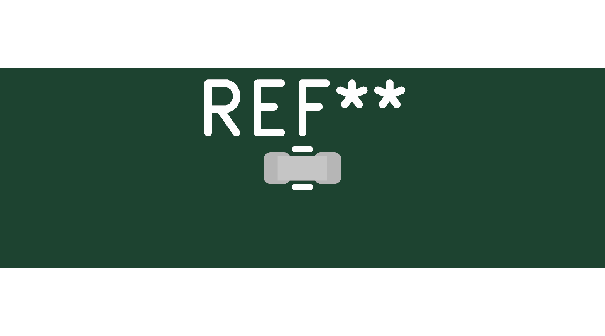
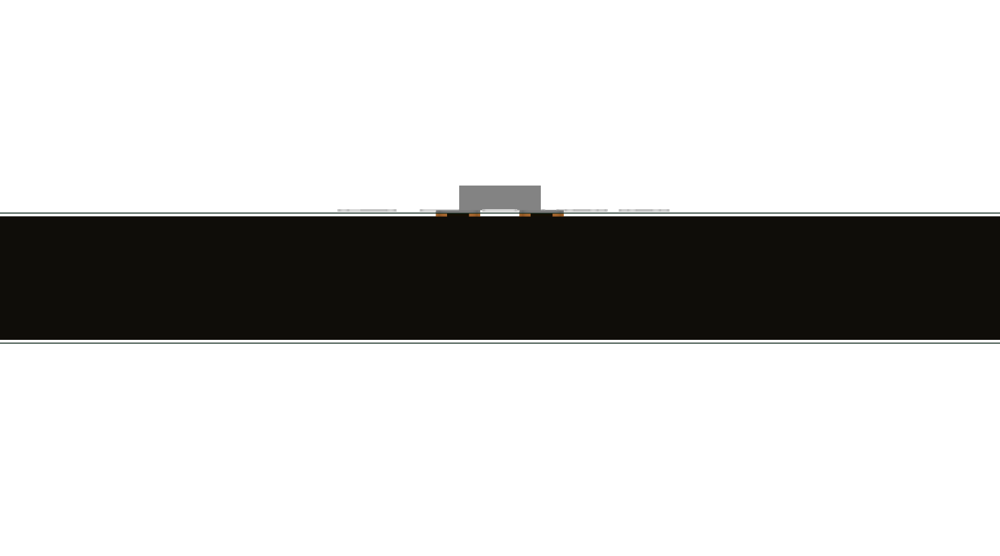
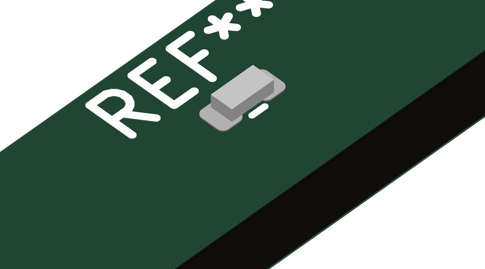

# RT0402BRD079K09L (C852966) → Resistor_KSL

Created 8 September 2026 for the approved Wi-Fi feedback margin correction. [Search exact part](https://search.raph.io/?q=C852966).

| Evidence | Verified result / limitation |
|---|---|
| Exact source | [Public Yageo generated specification](https://yageogroup.com/component-documentation/download/specsheet/RT0402BRD079K09L), one-page English document generated8September2026; exact MPN verified. Local property `${KSL_ROOT}/datasheets/RT0402BRD079K09L.pdf`. |
| Electrical | 9.09kΩ, ±0.1%, TCR ±25ppm/°C,0.063W at70°C,50V working voltage; −55…155°C component range. The project uses −40…85°C. |
| Body | Manufacturer nominal1.0×0.5×0.3mm; tolerances ±0.1/±0.05/±0.05mm. No polarity; symbol1/2 correspond to copper1/2. |
| Copper | KiCad stock IPC-7351 nominal R_0402_1005Metric lands: centersX±0.51mm,0.54×0.64mm pads. This is an IPC land-pattern basis, **not a manufacturer-recommended layout**. Verify paste/reflow yield before fabrication. |
| CAD sources | JLC2KiCadLib successfully downloaded both exact parts into `/tmp/remote-yageo-jlc`; provider used generic R0402. Stock KiCad symbol/land geometry retained as the documented basis; generated source-backed nominal envelope used for the model. |
| Model | Simplified uncolored1.0×0.5×0.3mm box, centeredXY and seatedZ0 with unit scale and no rotation; it is **not vendor CAD** and omits end-cap detail. Use maximum tolerance dimensions for clearance. Top/front/iso inspected; no penetration or remote offset. |
| Readability changes | Default symbol Reference/Value moved beside the body horizontally. Tiny-footprint F.Fab reference moved outside the body and enlarged to0.5mm. No copper numbering or geometry altered from stock. |
| Sourcing | Direct [LCSC page](https://www.lcsc.com/product-detail/C852966.html) observed8September2026 showed15,100units and applicable price$.0240each for a1000piece order. Stock unreserved; this supersedes earlier search snippets. |
| Gates | Symbol/footprint parse; model gate:0newviolations,17existingbaselineissues; NDA tree gate passes. Datasheet verifier includes both parts as accepted exact English sources; whole repo has2pre-existing missing capacitor links. |

