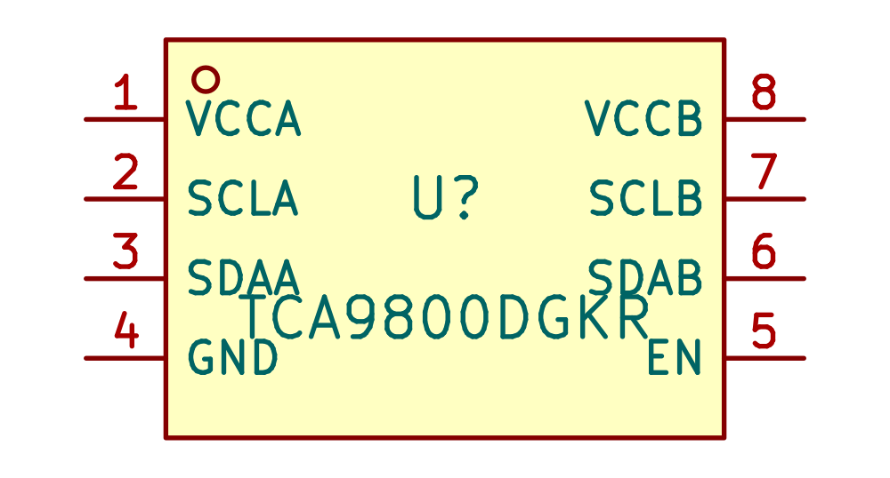
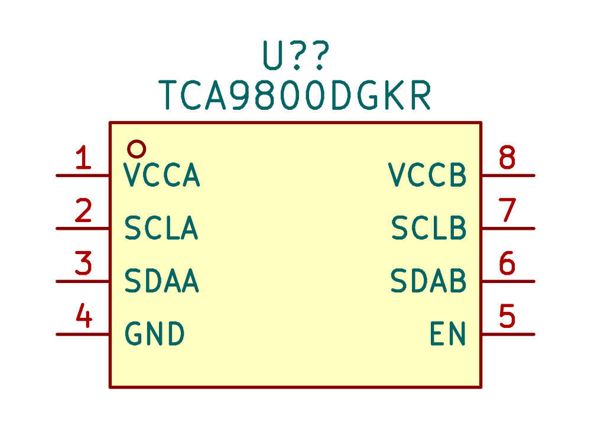
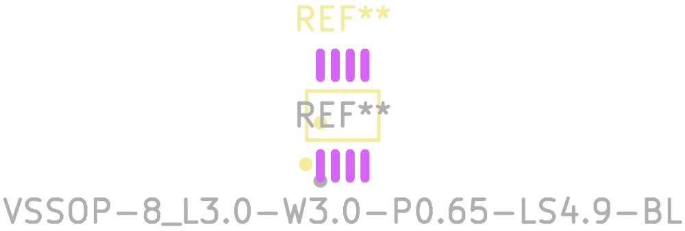
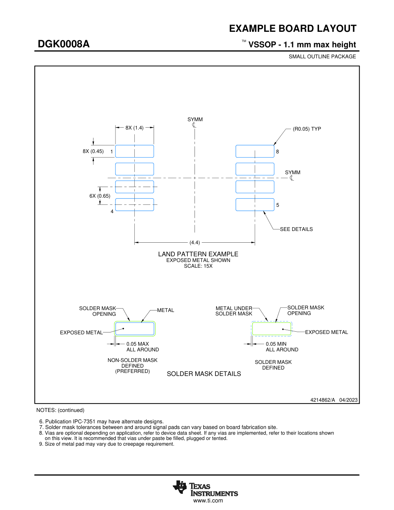
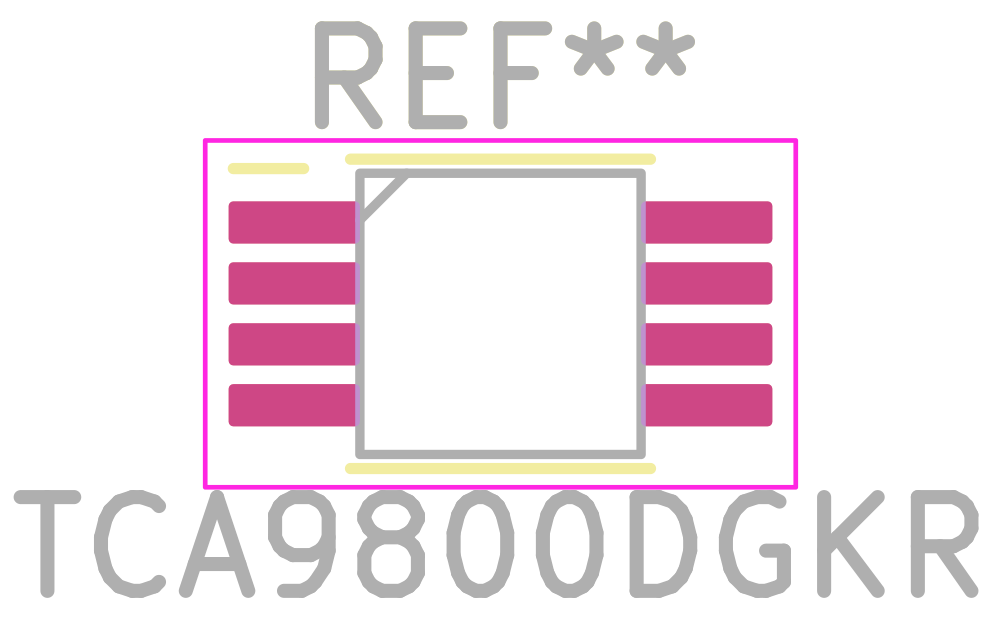
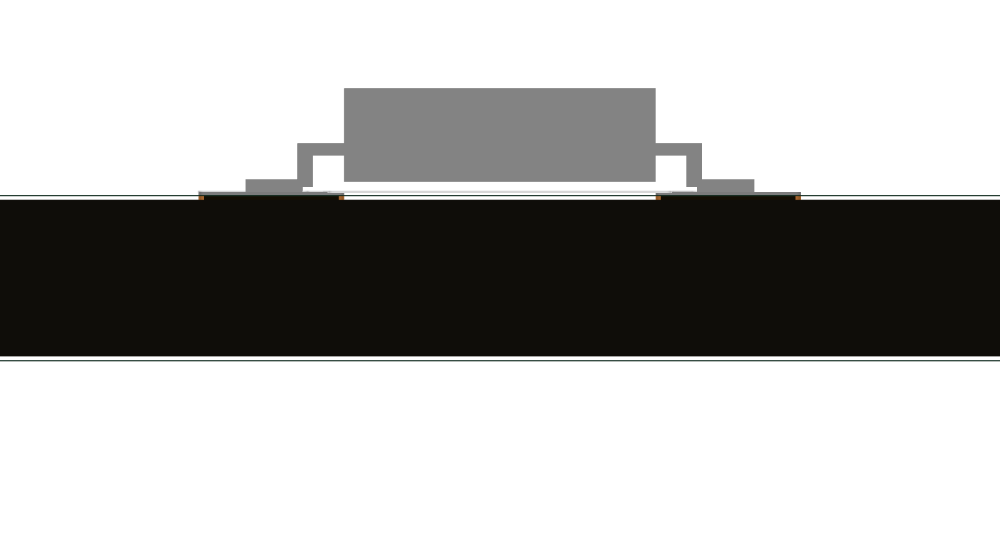
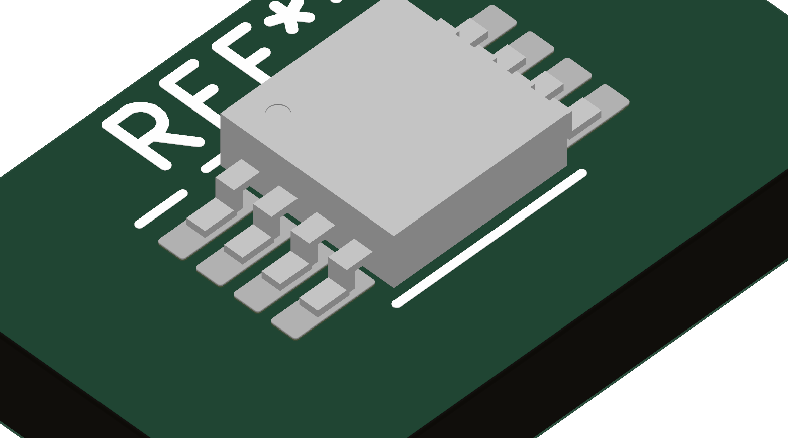

# TCA9800DGKR (C2677364) → Interface_KSL

Created 8 September 2026 as the source-backed I²C buffer support part. [Search exact part](https://search.raph.io/?q=C2677364).

| Evidence | Verified result / remaining qualification |
|---|---|
| Primary source | [TI TCA9800 SCPS264B Rev B](https://www.ti.com/lit/ds/symlink/tca9800.pdf), exact orderable DGKR in the addendum. Public English PDF is local at `${KSL_ROOT}/datasheets/TCA9800DGKR.pdf`. |
| Pin map | p3: 1 VCCA, 2 SCLA, 3 SDAA, 4 GND, 5 EN, 6 SDAB, 7 SCLB, 8 VCCB. Power inputs 1/4/8, digital input 5, bidirectional 2/3/6/7. Eight numbered copper lands match eight schematic pins. No exposed pad. |
| Supply / interface | VCCA 0.8–3.6 V, VCCB 1.65–3.6 V, ambient −40…125°C. EN refers to VCCA. B side uses an internal current source; **do not add B-side pull-ups**. A side needs external pull-ups. Source-specific VOL/current/rise-time and endpoint compatibility still belong in the circuit review. |
| Exact mechanical variant | DGK0008A drawing4214862/A, April2023, PDF pp35–36: body nominal3×3mm,2.9–3.1mm tolerance, total lead span4.75–5.05mm, maximum height1.1mm, lead pitch0.65mm. Top-view pin1 is upper-left. |
| Copper | Exact TI land example: eight1.4×0.45mm rounded rectangular pads, centersX±2.2mm, Y−0.975/−0.325/+0.325/+0.975mm. Pin1 at(−2.2,−0.975), pin8 opposite. Non-solder-mask-defined lands; final mask/paste tolerances remain board-fabricator inputs. |
| Model | Generated simplified nominal model,3×3mm body,0.1mm standoff,1.0mm total height,4.9mm lead span. Stepped leads represent seating and pin1 recess identifies orientation. It is **not manufacturer CAD** and does not model exact lead bends/mold detail; use1.1mm maximum height and body tolerances for enclosure clearance. Unit scale, zero offset, zero rotation. |
| CAD input defects | JLC2KiCadLib C2677364 successfully returned CAD, but the symbol linked to unrelated **REF5020**; all pin types were unspecified. Imported lands were0.38×1.45mm instead of the selected TI example. Its legacy inch-valued model offset was roughly(−34.47,+31.42), and raw STEP leads extended0.160mm below its origin. These inputs were corrected or replaced before entering the library. |
| Readability | Symbol fields moved above body. Footprint has an external fab reference, correctly located pin1 mark and courtyard. Copper and body are shown separately. |
| Checks | Symbol/footprint parse, source pin/pad mapping, exact land geometry, and top/front/isometric renders inspected. Model gate:0new issues,17existing baseline issues. NDA tree gate passes. Canonical English verdict accepted; whole-library datasheet gate reports only2existing missing capacitor links. |
| Sourcing | Direct [LCSC listing](https://www.lcsc.com/product-detail/C2677364.html) on8September2026 showed200units and$0.8113 at the1,000piece tier. **Stock does not cover the1k batch**; secure another source or lead time before release. No substitute buffer was silently chosen. |

