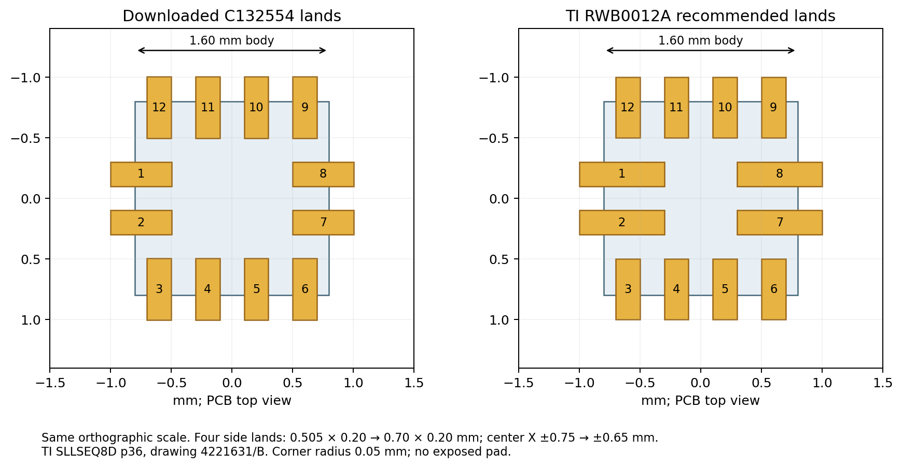
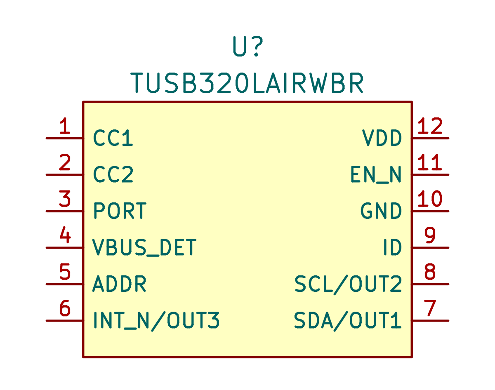
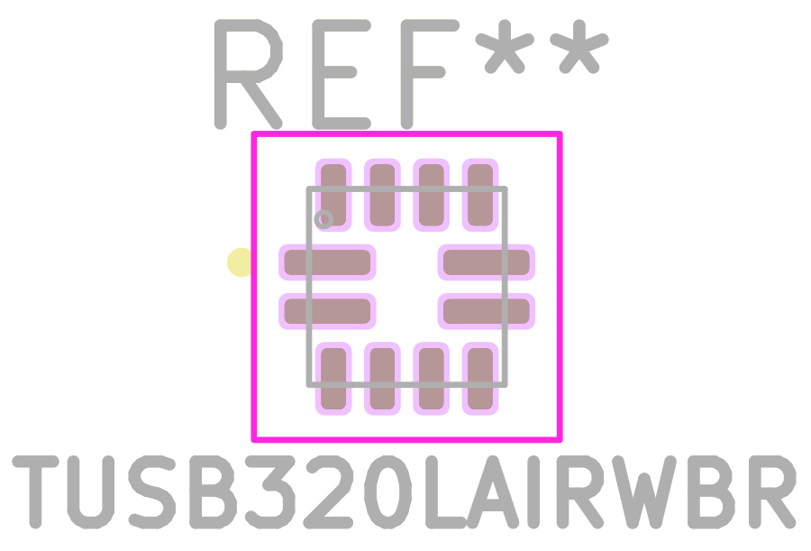
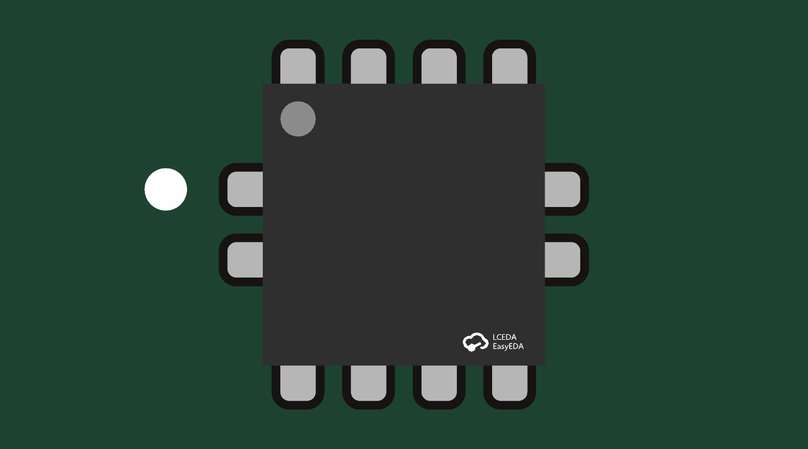
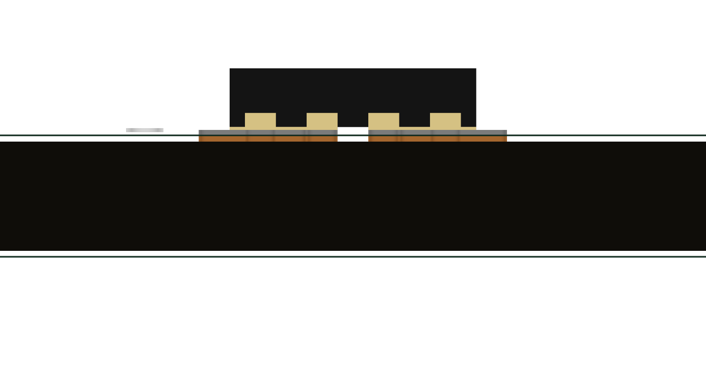
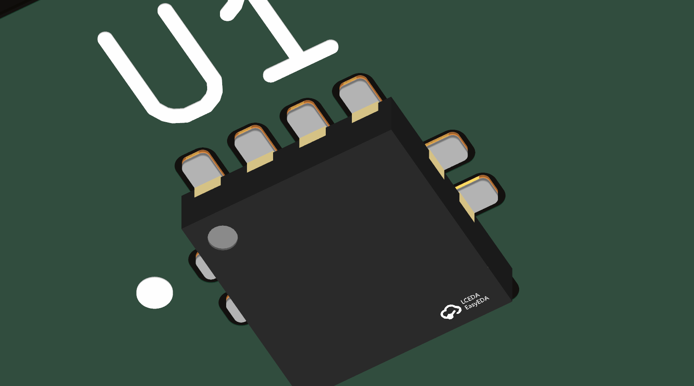

# TUSB320LAIRWBR — exact RWB package and 1.8 V I²C variant

8 September 2026. Added **[TUSB320LAIRWBR / C132554](https://search.raph.io/?q=C132554)** after confirming it was absent. Followed the KSL existence → download → verify/correct workflow: downloaded C132554 with JLC2KiCadLib, preserved the usable provider STEP and corrected the symbol/lands against [TI SLLSEQ8D revD](https://www.ti.com/lit/ds/symlink/tusb320lai.pdf). This is the active-low-enable **LAI** device in RWB0012A, not the older TUSB320 or HA variant.

| Item | Verified detail |
|---|---|
| Symbol | `Power_Management_IC_KSL:TUSB320LAIRWBR`; twelve pins, correct signal identities/types from p3 |
| Footprint | `Power_Management_IC_KSL:X2QFN-12_TUSB320LAI_RWB0012A_1.6x1.6mm` |
| Body | 1.60 ×1.60 mm nominal, 1.55–1.65 mm XY, 0.40 mm maximum height; p35 |
| Copper | Eight 0.20 ×0.50 mm top/bottom lands; four 0.70 ×0.20 mm side lands, p36; 0.40 mm pitch |
| Electrical pad identities | 1–12 exactly; no exposed pad, NPTH or invented pin13 |
| Pin1 orientation | PCB top-view upper-left side land; TI package bottom-view drawing reflected once |
| Source file | `${KSL_ROOT}/datasheets/TUSB320LAIRWBR.pdf`, public English revD, 38 physical pages |
| Model | Retained provider C132554 STEP, neutral offset/scale/rotation; approximately 1.6 ×1.6 ×0.401 mm including an illustrative 0.001 mm top marking |

The source drawing's PCB lands have four longer side pads centered at X=±0.650 mm. The downloaded footprint instead used approximately 0.505 ×0.200 mm side lands centered at X=±0.750 mm. Corrected these demonstrated differences, normalized the eight top/bottom lands to the source's 0.500 mm length and 0.750 mm Y center, and used the source R0.05 corner radius. No other library parts were changed. The imported symbol's unspecified pin types and mismatched remote datasheet link were replaced with the exact pin-table types and local source.

Solder-mask expansion 0.05 mm and the 0.25 mm copper-to-courtyard allowance are stated engineering allowances. The source recommends non-solder-mask-defined pads; PCB fabrication and stencil rules still need assembly review. Paste uses the recommended land shapes; there is no separate exposed-pad paste region. Pin1 dots, colors and top marking are illustrative rather than manufacturer construction details.

The symbol uses VDD/GND as power inputs; CC1/CC2 and I²C as bidirectional; PORT/ADDR/VBUS_DET/EN_N as inputs; INT_N and ID as open-drain outputs. The compact body preserves readable pin names and numbered 2.54 mm stubs. VDD is 2.7–5 V; I²C supports 1.65–3.6 V. Other inputs are not assumed fail-safe when the device is unpowered. These are source facts, not permission to connect arbitrary 3.3 V pull-ups while VDD is absent.

The STEP was not rebuilt unnecessarily: bounding-box inspection found XY ±0.8000001 mm, bottom Z≈0, top Z=0.4010001 mm. Top/front/isometric coupon views were all inspected, with both KSL_ROOT and KNL_ROOT explicitly supplied. It is a provider envelope with illustrative terminal detail and marking; it does not verify package tolerances, solder-joint geometry or placement within a product assembly. Use TI's 0.40 mm package-height maximum, plus assembly tolerances, for real clearance decisions.

Verification:

- Exact symbol-to-numbered-copper parity: twelve identities, no missing/extra electrical terminal. Source geometry and pin map are in [source-geometry.json](source-geometry.json); KiCad API inspection is in [footprint-audit.json](footprint-audit.json).
- Rebuilt the coupon from the final footprint before rendering. Coupon DRC: zero violations and zero unconnected items.
- Model gate: 176 library footprints, 165 model references; 148 clear and 17 existing baselined seating problems, **zero new violations**.
- Datasheet gate: 236 linked sources OK, 22 generic exemptions; two pre-existing unrelated capacitor links remain absent (`GRM155R61C475ME15D`, `GRM188R61A226ME15D`). The TUSB English source passed.
- Public-library NDA gate: no restricted documents found.

Reproducible builder and coupon tool: `Power_Management_IC_KSL/scripts/build_tusb320lai.py` and `render_tusb320lai.py`. The source geometry is shared with the evidence. Electrical application validation—including source-current changes, USB default/suspend behavior and firmware timeouts—belongs to the consuming product, not a library acceptance claim.
