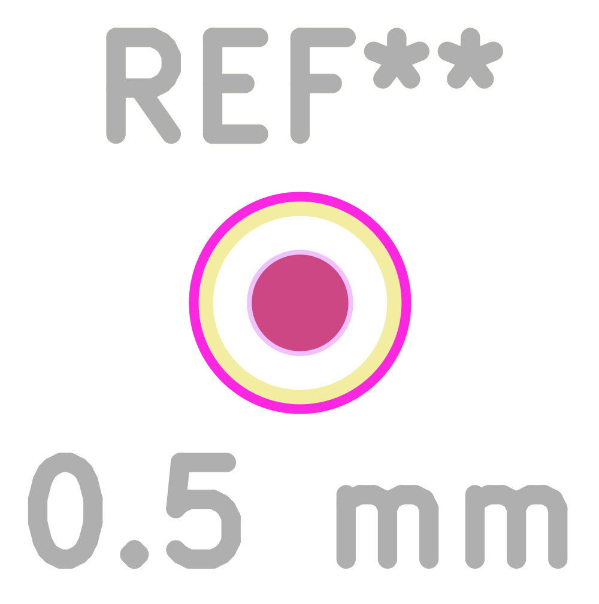

# Generic 0.5 mm fixture pad

A bare PCB copper test point for remote USB fixture pads TP407/TP408. The requested 0.5 mm pad did not exist in KSL or the installed stock library; KSL's existing 1.0 mm bare pad supplied the layer/numbering convention. This is defined PCB geometry, not a purchased component, so no manufacturer MPN, datasheet or separate 3D body applies.

- Single numbered copper pad **1**, circular **0.50 mm diameter** on F.Cu.
- F.Mask opening **0.55 mm diameter** from explicit 0.025 mm expansion per side; **no solder paste**.
- Silk circle radius 0.50 mm with 0.10 mm line; courtyard radius 0.55 mm. These are design clearances, not a probe manufacturer's dimensions.
- Retain the existing one-pin schematic test-point symbol and its net; the consuming schematic assigns this footprint explicitly. No connector, polarity or mating orientation is involved.
- Bare test-pad copper is rendered by PCB tools itself; no artificial STEP body is attached. Model seating is not applicable.

The fixture team must qualify probe tip diameter, positional tolerance, finish, repeated contact and clearances. The PCB team must keep the USB stub short and qualify its eye/loading; a small pad alone does not prove USB signal integrity. This footprint adds real copper to replace an unresolved name; it does not qualify final fixture placement.

Validation on 8 September 2026: actual KiCad footprint SVG exported and inspected; pin 1 is the only 0.50 mm copper pad, mask opening 0.55 mm, no paste or model. The consuming project explicitly registers TestPoint_KSL. An isolated complete-project ERC has no unresolved footprint references after this change. Full model/geometry and NDA gates pass; the datasheet gate retains the two previously documented provisional capacitor source gaps, unrelated to this generic pad.

The accompanying capacitor metadata correction changes missing Datasheet values from `~` to empty in the two canonical entries and their consuming cache. Their parsed CAD already matched, but KiCad's library comparison handled `~` inconsistently. The empty standard value removes seven misleading cache warnings in an isolated full ERC without changing pins, geometry or component values. Source-gap descriptions and reports remain intact.
